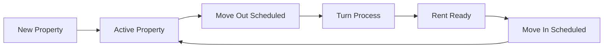
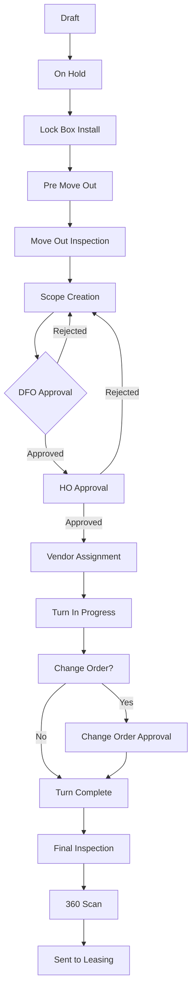
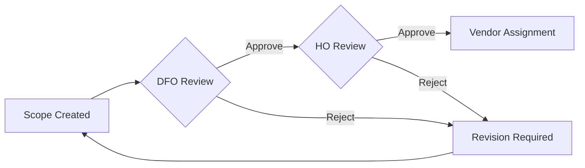

# Turns Management Web Application - Comprehensive Project Plan

## Executive Summary

This document outlines the complete plan for migrating the Odoo-based Turns Management ERP to a modern, standalone web application using Next.js, Tailwind CSS v4, shadcn/ui, and PostgreSQL.

## Project Goals

1. **Modernize the User Experience**: Create an intuitive, responsive interface
2. **Improve Performance**: Faster load times and real-time updates
3. **Enhance Scalability**: Cloud-native architecture
4. **Simplify Maintenance**: Clean codebase with modern tooling
5. **Mobile-First Design**: Full functionality on all devices

## Current System Analysis

### Existing Odoo Modules
1. **Property Management** (`property/`)
   - Master data for all properties
   - Property details and status tracking
   - Document management

2. **Turns Management** (`turns_management/`)
   - Complete turn workflow from draft to completion
   - Multi-stage approval process
   - Vendor management
   - Lock box tracking

3. **Utility Management** (`utility_management/`, `property_utility_bill/`)
   - Utility provider tracking
   - Bill management and payments
   - Schedule management

4. **Move Out Scheduling** (`move_out_prt_schedule/`)
   - Move out date tracking
   - Inspection scheduling
   - Property status updates

5. **Reporting** (`turns_report/`)
   - Turn reports
   - Vendor performance reports
   - Financial summaries

## Workflow Mappings

### 1. Property Lifecycle Workflow



### 2. Turn Management Workflow



### 3. Approval Workflow



## UI/UX Improvements

### 1. Dashboard Redesign

**Current Issues:**
- Cluttered interface
- Poor information hierarchy
- Limited customization

**Improvements:**
```typescript
interface DashboardFeatures {
  // Customizable widgets
  widgets: [
    'PropertyOverview',
    'ActiveTurns',
    'PendingApprovals',
    'VendorPerformance',
    'FinancialSummary'
  ],
  
  // Real-time updates
  realtime: {
    notifications: true,
    statusUpdates: true,
    approvalAlerts: true
  },
  
  // Quick actions
  quickActions: [
    'CreateTurn',
    'ScheduleInspection',
    'ApproveScope',
    'AssignVendor'
  ]
}
```

### 2. Property Management Interface

**Enhanced Features:**
- **Smart Search**: Full-text search with filters
- **Bulk Operations**: Multi-select actions
- **Interactive Map View**: Visualize property locations
- **Quick Edit Mode**: Inline editing
- **Document Preview**: Built-in viewer

### 3. Turn Management Board

**Kanban Board Improvements:**
```typescript
interface KanbanFeatures {
  // Drag-and-drop with validation
  dragDrop: {
    enabled: true,
    validation: true,
    confirmationRequired: true
  },
  
  // Card customization
  cardDisplay: {
    priority: 'color-coded',
    daysInStage: true,
    vendor: true,
    amount: true,
    progressBar: true
  },
  
  // Filtering
  filters: {
    property: true,
    vendor: true,
    dateRange: true,
    amount: true,
    status: true
  }
}
```

### 4. Mobile Experience

**Mobile-Optimized Features:**
- Touch-friendly controls
- Swipe gestures for navigation
- Offline mode support
- Camera integration for photos
- Push notifications

### 5. Reporting Dashboard

**Interactive Reports:**
- Drill-down capabilities
- Export to multiple formats
- Scheduled reports
- Custom report builder
- Real-time data visualization

## Implementation Roadmap

### Phase 1: Foundation (Weeks 1-4)

#### Week 1-2: Project Setup
- [ ] Initialize Next.js project with TypeScript
- [ ] Configure Tailwind CSS v4
- [ ] Set up shadcn/ui components
- [ ] Configure PostgreSQL with Prisma
- [ ] Implement Better-Auth

#### Week 3-4: Core Infrastructure
- [ ] Database schema implementation
- [ ] API structure (tRPC setup)
- [ ] Authentication flows
- [ ] Role-based access control
- [ ] File upload system

### Phase 2: Core Modules (Weeks 5-12)

#### Week 5-6: Property Management
- [ ] Property CRUD operations
- [ ] Property listing with filters
- [ ] Property detail views
- [ ] Document management
- [ ] Import/Export functionality

#### Week 7-8: Turn Management Core
- [ ] Turn creation workflow
- [ ] Stage management system
- [ ] Kanban board interface
- [ ] Basic approval workflow
- [ ] Email notifications

#### Week 9-10: Vendor & User Management
- [ ] Vendor registration
- [ ] Vendor assignment
- [ ] User management
- [ ] Permission system
- [ ] Activity logging

#### Week 11-12: Utilities & Scheduling
- [ ] Utility provider management
- [ ] Bill tracking
- [ ] Move out scheduling
- [ ] Calendar integration
- [ ] Reminder system

### Phase 3: Advanced Features (Weeks 13-18)

#### Week 13-14: Approval Workflows
- [ ] Multi-level approvals
- [ ] Rejection handling
- [ ] Approval history
- [ ] Notification system
- [ ] Delegation features

#### Week 15-16: Reporting & Analytics
- [ ] Dashboard widgets
- [ ] Standard reports
- [ ] Custom report builder
- [ ] Export functionality
- [ ] Data visualization

#### Week 17-18: Document Management
- [ ] File upload/download
- [ ] Document categorization
- [ ] Version control
- [ ] Preview functionality
- [ ] Cloud storage integration

### Phase 4: Enhancement & Optimization (Weeks 19-22)

#### Week 19-20: Performance & Testing
- [ ] Performance optimization
- [ ] Load testing
- [ ] Security audit
- [ ] Bug fixes
- [ ] Code refactoring

#### Week 21-22: Mobile & PWA
- [ ] Progressive Web App setup
- [ ] Offline functionality
- [ ] Push notifications
- [ ] Mobile testing
- [ ] App store deployment prep

### Phase 5: Migration & Deployment (Weeks 23-26)

#### Week 23-24: Data Migration
- [ ] Data extraction from Odoo
- [ ] Data transformation scripts
- [ ] Migration testing
- [ ] Data validation
- [ ] Rollback procedures

#### Week 25-26: Deployment & Training
- [ ] Production deployment
- [ ] User training materials
- [ ] Documentation
- [ ] Support setup
- [ ] Go-live preparation

## Technical Implementation Details

### Component Structure

```typescript
// Project structure
src/
├── app/                      # Next.js app directory
│   ├── (auth)/              # Authentication pages
│   ├── (dashboard)/         # Main application
│   │   ├── properties/
│   │   ├── turns/
│   │   ├── vendors/
│   │   ├── reports/
│   │   └── settings/
│   └── api/                 # API routes
├── components/
│   ├── ui/                  # shadcn/ui components
│   ├── features/            # Feature-specific components
│   └── layouts/             # Layout components
├── lib/
│   ├── auth/               # Authentication utilities
│   ├── db/                 # Database utilities
│   └── utils/              # Helper functions
├── hooks/                   # Custom React hooks
├── services/               # Business logic
└── types/                  # TypeScript types
```

### Key Features Implementation

#### 1. Real-time Updates
```typescript
// Using Server-Sent Events for real-time updates
interface RealtimeConfig {
  channels: {
    turns: '/api/sse/turns',
    approvals: '/api/sse/approvals',
    notifications: '/api/sse/notifications'
  },
  reconnect: {
    enabled: true,
    interval: 5000,
    maxAttempts: 10
  }
}
```

#### 2. Advanced Search
```typescript
// Full-text search implementation
interface SearchConfig {
  indexes: ['properties', 'turns', 'vendors'],
  features: {
    fuzzySearch: true,
    filters: true,
    sorting: true,
    pagination: true
  },
  caching: {
    enabled: true,
    ttl: 300 // 5 minutes
  }
}
```

#### 3. Workflow Engine
```typescript
// Configurable workflow system
interface WorkflowEngine {
  stages: Stage[],
  transitions: Transition[],
  validations: Validation[],
  actions: {
    onEnter: Action[],
    onExit: Action[],
    onApprove: Action[],
    onReject: Action[]
  }
}
```

## Quality Assurance Plan

### Testing Strategy

1. **Unit Testing**
   - Jest for component testing
   - 80% code coverage target
   - Automated test runs

2. **Integration Testing**
   - API endpoint testing
   - Database transaction testing
   - Authentication flow testing

3. **E2E Testing**
   - Playwright for browser testing
   - Critical user journey coverage
   - Cross-browser compatibility

4. **Performance Testing**
   - Load testing with k6
   - Response time monitoring
   - Database query optimization

### Code Quality

```json
{
  "linting": "ESLint with strict rules",
  "formatting": "Prettier with consistent config",
  "typeChecking": "TypeScript strict mode",
  "codeReview": "PR reviews required",
  "documentation": "JSDoc for all public APIs"
}
```

## Risk Management

### Identified Risks

1. **Data Migration Complexity**
   - Mitigation: Phased migration with validation
   - Contingency: Maintain Odoo parallel run

2. **User Adoption**
   - Mitigation: Comprehensive training program
   - Contingency: Gradual rollout

3. **Performance Issues**
   - Mitigation: Load testing and optimization
   - Contingency: Scaling infrastructure

4. **Integration Challenges**
   - Mitigation: API-first design
   - Contingency: Custom adapters

## Success Metrics

### KPIs

1. **Performance Metrics**
   - Page load time < 2 seconds
   - API response time < 200ms
   - 99.9% uptime

2. **User Metrics**
   - User adoption rate > 90%
   - Task completion time reduced by 40%
   - User satisfaction score > 4.5/5

3. **Business Metrics**
   - Turn processing time reduced by 30%
   - Approval cycle time reduced by 50%
   - Document processing automated by 80%

## Budget Estimation

### Development Costs
- Frontend Development: 400 hours
- Backend Development: 300 hours
- Database Design: 100 hours
- Testing & QA: 150 hours
- Project Management: 100 hours
- **Total: 1050 hours**

### Infrastructure Costs (Monthly)
- Hosting (Vercel Pro): $20
- Database (Supabase): $25
- File Storage (AWS S3): $50
- Email Service: $20
- Monitoring: $30
- **Total: $145/month**

## Conclusion

This comprehensive plan provides a clear roadmap for migrating from the Odoo-based system to a modern web application. The phased approach ensures minimal disruption while delivering significant improvements in user experience, performance, and maintainability.

## Next Steps

1. Review and approve the plan
2. Set up development environment
3. Begin Phase 1 implementation
4. Establish weekly progress reviews
5. Prepare user communication plan