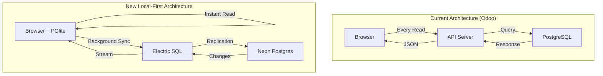

# Turns Management - Local-First Project Plan

## Executive Summary

Complete migration plan from Odoo ERP to a modern **local-first web application** using Electric SQL sync, Neon Postgres, and PGlite. This architecture delivers native-app performance with zero loading states and full offline capabilities.

## Project Goals

### Primary Objectives
1. **Instant Performance**: Sub-millisecond response times via local database
2. **Offline-First**: Full functionality without internet connection
3. **Real-Time Sync**: Automatic propagation across all clients
4. **Cost Reduction**: 90% fewer API calls, reduced server load
5. **Developer Velocity**: Simplified state management with local database

### Success Metrics
- **Performance**: < 50ms UI response time (currently 200-500ms)
- **Availability**: 100% offline functionality (currently 0%)
- **Sync Latency**: < 1 second for updates (currently 3-5 seconds)
- **API Reduction**: 90% fewer API calls
- **Cost Savings**: 50% reduction in infrastructure costs

## Architecture Migration

### From Traditional to Local-First



## Implementation Phases

### Phase 1: Infrastructure Foundation (Weeks 1-2)

#### Week 1: Core Setup
- [ ] **Neon Database Setup**
  - Create primary database
  - Configure read replica
  - Set up logical replication
  - Create development branches
  
- [ ] **Electric SQL Deployment**
  - Deploy Electric service (Fly.io)
  - Configure shapes and permissions
  - Set up monitoring
  - Test replication pipeline

- [ ] **Development Environment**
  - Docker compose for local dev
  - PGlite integration in Next.js
  - Drizzle ORM dual schemas
  - TypeScript configuration

#### Week 2: Authentication & Base UI
- [ ] **Better-Auth Setup**
  - User authentication flows
  - Session management
  - Role-based permissions
  - Shape authorization

- [ ] **Base Application Shell**
  - Next.js app structure
  - Tailwind CSS v4 setup
  - shadcn/ui components
  - Layout components

### Phase 2: Local-First Data Layer (Weeks 3-4)

#### Week 3: Write Pattern Selection & Implementation

**⚡ Decision Point: Choose Write Pattern**

Electric SQL supports 4 write patterns. We recommend **Pattern 3: Shared Persistent Optimistic State** for Turns Management.

| Pattern | Complexity | Offline | Setup Time | Fits Turns Mgmt? |
|---------|------------|---------|------------|------------------|
| Pattern 1: Online | ⭐ | ❌ | 30min | ❌ Need offline |
| Pattern 2: useOptimistic | ⭐⭐ | ⏱️ | 2hrs | ❌ Not persistent |
| **Pattern 3: Zustand + PGlite** | ⭐⭐⭐ | ✅ | 1 day | ✅ **Recommended** |
| Pattern 4: Shadow Tables | ⭐⭐⭐⭐ | ✅ | 3 days | ⚠️ Overkill |

**Why Pattern 3 for Turns Management:**
- ✅ **Zustand**: Already in our tech stack
- ✅ **Persistent**: Property managers work offline
- ✅ **Shared State**: Turn updates across all components  
- ✅ **Better Auth**: Integrates with user permissions
- ✅ **Mobile-First**: Critical for field workers

- [ ] **Implement Pattern 3: Zustand Write Store**
  ```typescript
  // Zustand store with persistence
  interface WriteStore {
    pendingWrites: PendingWrite[]
    rejectedWrites: PendingWrite[]
    isOnline: boolean
    addPendingWrite: (write) => void
    syncPendingWrites: () => Promise<void>
  }
  
  // Optimistic operations
  export const optimisticWrites = {
    updateProperty: async (id, updates) => {
      // 1. Update PGlite (instant UI)
      await db.update(properties).set(updates).where(eq(properties.id, id))
      
      // 2. Queue for server sync
      writeStore.addPendingWrite({ table: 'properties', operation: 'update', data: updates })
    }
  }
  ```

- [ ] **Shape Definitions**
  ```typescript
  // Core shapes for initial sync
  const shapes = {
    properties: { table: 'properties', where: 'manager_id = $1' },
    activeTurns: { table: 'turns', where: 'is_active = true' },
    vendors: { table: 'vendors', where: 'is_approved = true' },
    turnStages: { table: 'turn_stages' }
  }
  ```

- [ ] **Sync Manager**
  - Shape subscription management
  - Offline detection
  - Sync status tracking
  - Error recovery

- [ ] **Background Sync Service**
  - Auto-sync every 30 seconds when online
  - Immediate sync when network returns
  - Retry failed writes with exponential backoff
  - Conflict resolution (last-write-wins initially)

#### Week 4: Data Migration
- [ ] **Odoo Data Export**
  - Properties and metadata
  - Turn history
  - User accounts
  - Document references

- [ ] **Data Transformation**
  - Schema mapping
  - Data validation
  - Relationship preservation
  - Audit trail creation

- [ ] **Import to Neon**
  - Batch import scripts
  - Data verification
  - Index optimization
  - Initial shape generation

### Phase 3: Core Features (Weeks 5-8)

#### Week 5-6: Property Management
- [ ] **Local Property Operations**
  ```typescript
  // All reads from local PGlite
  const properties = await db.select()
    .from(properties)
    .where(eq(properties.isActive, true))
  // Instant results, no loading state needed
  ```

- [ ] **Property CRUD**
  - Create with optimistic updates
  - Edit with conflict resolution
  - Bulk operations
  - Document attachments

- [ ] **Search & Filtering**
  - Full-text search locally
  - Advanced filters
  - Saved searches
  - Export functionality

#### Week 7-8: Turn Management with Optimistic Updates

- [ ] **Kanban Board with Pattern 3 Writes**
  ```typescript
  // Drag-drop uses optimistic writes
  const handleStageDrop = async (turnId: string, newStageId: string) => {
    // 1. Update local PGlite instantly
    await optimisticWrites.updateTurn(turnId, { stageId: newStageId })
    
    // 2. UI updates immediately (no loading)
    // 3. Background sync to server
    // 4. Electric propagates to other users
  }
  ```
  - Drag-drop with instant local updates
  - Real-time propagation via Electric
  - Offline-capable stage transitions
  - Visual pending indicators

- [ ] **Turn Workflow with Write Queuing**
  ```typescript
  // Complex approval workflow with offline support
  async function submitForApproval(turnId: string) {
    // Optimistic update
    await optimisticWrites.updateTurn(turnId, {
      approvalStatus: 'DFO_APPROVAL_NEEDED',
      submittedAt: new Date()
    })
    
    // Queue email notification (server-side)
    writeStore.addPendingWrite({
      table: 'notifications',
      operation: 'create',
      data: { type: 'approval_needed', turnId }
    })
  }
  ```

- [ ] **Approval System**
  - DFO/HO approval flows with optimistic state
  - Notification system via write queue
  - Audit logging (every action tracked)
  - Email integration (queued when offline)

- [ ] **Write Pattern Validation**
  - Test offline → online → sync scenarios
  - Verify conflict resolution works
  - Validate pending write persistence
  - Performance test with 100+ pending writes

### Phase 4: Advanced Features (Weeks 9-12)

#### Week 9: Vendor Management
- [ ] **Vendor Directory**
  - Local vendor database
  - Performance metrics
  - Assignment workflow
  - Rating system

- [ ] **Vendor Portal**
  - Limited shape access
  - Work order visibility
  - Document upload
  - Status updates

#### Week 10: Reporting & Analytics
- [ ] **Local Analytics**
  ```typescript
  // Complex queries run locally
  const metrics = await db.select({
    avgTurnTime: avg(turnDuration),
    totalCost: sum(turnAmount),
    vendorPerformance: ...
  }).from(turns)
  // Instant results from PGlite
  ```

- [ ] **Dashboard Widgets**
  - Real-time metrics
  - Trend analysis
  - Custom reports
  - Export to PDF/Excel

#### Week 11: Offline Capabilities
- [ ] **Service Worker**
  - App shell caching
  - Background sync
  - Push notifications
  - Update prompts

- [ ] **Conflict Resolution**
  - Automatic merging
  - User resolution UI
  - Conflict history
  - Rollback capability

#### Week 12: Mobile Optimization
- [ ] **Progressive Web App**
  - Install prompts
  - App icons
  - Splash screens
  - Native features

- [ ] **Mobile UI**
  - Touch-optimized
  - Gesture support
  - Responsive layouts
  - Performance tuning

### Phase 5: Production Readiness (Weeks 13-14)

#### Week 13: Testing & QA
- [ ] **Test Coverage**
  - Unit tests (> 80%)
  - Integration tests
  - E2E tests
  - Sync tests

- [ ] **Performance Testing**
  - Load testing with K6
  - Sync performance
  - Offline scenarios
  - Memory profiling

#### Week 14: Deployment
- [ ] **Production Setup**
  - Neon production database
  - Electric on Fly.io
  - Vercel deployment
  - Monitoring setup

- [ ] **Migration**
  - User training
  - Data verification
  - Gradual rollout
  - Fallback plan

## Technical Implementation Details

### Local-First Patterns

#### 1. Optimistic Updates
```typescript
// Update locally first
async function updateProperty(id: string, data: any) {
  // 1. Update PGlite immediately
  await localDb.update(properties)
    .set({ ...data, _synced: false })
    .where(eq(properties.id, id))
  
  // 2. UI reflects change instantly
  revalidate()
  
  // 3. Queue for server sync
  await queueWrite({ table: 'properties', id, data })
}
```

#### 2. Shape Subscriptions
```typescript
// Subscribe to user-relevant data
async function initUserShapes(userId: string) {
  const shapes = [
    // Properties managed by user
    electric.sync({
      table: 'properties',
      where: `manager_id = '${userId}'`
    }),
    
    // Active turns for those properties
    electric.sync({
      table: 'turns',
      where: 'property_id IN (SELECT id FROM properties WHERE manager_id = $1)',
      params: [userId]
    })
  ]
  
  await Promise.all(shapes)
}
```

#### 3. Conflict Resolution
```typescript
// Handle write conflicts
async function resolveConflict(local: any, server: any) {
  // Last-write-wins by default
  if (server.version > local.version) {
    return server
  }
  
  // Field-level merge for text
  if (local.type === 'text') {
    return mergeText(local, server)
  }
  
  // User resolution for critical data
  return await showConflictUI(local, server)
}
```

### Performance Optimizations

#### 1. Shape Design
```typescript
// Minimize shape size
const efficientShape = {
  table: 'properties',
  columns: ['id', 'name', 'address', 'status'], // Only needed columns
  where: 'is_active = true AND updated_at > $1',
  params: [thirtyDaysAgo],
  limit: 1000 // Paginate large datasets
}
```

#### 2. Lazy Loading
```typescript
// Load shapes on demand
const shapeLoader = {
  core: ['properties', 'activeTurns'], // Load immediately
  secondary: ['vendors', 'turnStages'], // Load after core
  onDemand: ['auditLogs', 'documents'] // Load when needed
}
```

#### 3. Index Strategy
```sql
-- Client-side indexes for common queries
CREATE INDEX idx_properties_search ON properties(name, address);
CREATE INDEX idx_turns_active ON turns(is_active, stage_id);
CREATE INDEX idx_sync_pending ON properties(_synced) WHERE _synced = false;
```

## Risk Mitigation

### Technical Risks

| Risk | Impact | Mitigation |
|------|--------|------------|
| **Sync Conflicts** | Data inconsistency | Versioning + audit trail |
| **Large Dataset** | Performance issues | Shape pagination + filtering |
| **Offline Duration** | Stale data | TTL + forced refresh |
| **Browser Storage** | Quota exceeded | Data pruning + compression |

### Business Risks

| Risk | Impact | Mitigation |
|------|--------|------------|
| **User Adoption** | Low usage | Training + gradual rollout |
| **Data Migration** | Data loss | Backup + verification |
| **Vendor Resistance** | Integration issues | Portal + support |
| **Regulatory** | Compliance | Audit logs + encryption |

## Success Criteria

### Phase 1 Success (Week 2)
- ✅ Neon database operational with read replica
- ✅ Electric SQL streaming changes
- ✅ PGlite storing data locally
- ✅ Basic auth working

### Phase 2 Success (Week 4)
- ✅ Shapes syncing to browser
- ✅ Offline writes queued
- ✅ Data migrated from Odoo
- ✅ Sync status visible

### Phase 3 Success (Week 8)
- ✅ Properties fully functional offline
- ✅ Turns workflow complete
- ✅ Real-time updates working
- ✅ < 100ms response times

### Phase 4 Success (Week 12)
- ✅ All features working offline
- ✅ PWA installable
- ✅ Conflict resolution tested
- ✅ Mobile optimized

### Phase 5 Success (Week 14)
- ✅ 90% test coverage
- ✅ Production deployed
- ✅ Users trained
- ✅ Odoo decommissioned

## Budget & Resources

### Infrastructure Costs (Monthly)
```typescript
const monthlyCosts = {
  neon: {
    primary: 100,      // 1 CPU
    replica: 100,      // 1 CPU
    storage: 50,       // 100GB
    branches: 20       // Dev branches
  },
  electric: {
    fly_io: 50,        // 2 instances
    bandwidth: 30      // Shape streaming
  },
  vercel: {
    hosting: 20,       // Pro plan
    functions: 10      // API routes
  },
  total: 380,          // Per month
  annual: 4560,        // Per year
  savings: '60% less than current Odoo hosting'
}
```

### Development Team
- **Lead Developer**: Full-stack, Electric SQL experience
- **Frontend Dev**: React, local-first patterns
- **DevOps**: Neon, Fly.io deployment
- **QA Engineer**: Sync testing, offline scenarios
- **Project Manager**: Stakeholder coordination

## Training Plan

### User Training Modules
1. **Introduction to Local-First** (1 hour)
   - No more loading spinners
   - Offline capabilities
   - Real-time collaboration

2. **New Features** (2 hours)
   - Property management
   - Turn workflow
   - Reporting

3. **Troubleshooting** (1 hour)
   - Sync issues
   - Conflict resolution
   - Support channels

### Developer Documentation
- Architecture overview
- Local-first patterns
- Sync debugging
- Deployment guide

## Monitoring & Maintenance

### Key Metrics
```typescript
const monitoring = {
  performance: {
    syncLatency: '< 1s',
    queryTime: '< 50ms',
    conflictRate: '< 1%'
  },
  availability: {
    uptime: '99.9%',
    offlineCapability: '100%',
    syncReliability: '99.5%'
  },
  usage: {
    activeUsers: 'daily',
    syncVolume: 'hourly',
    errorRate: 'real-time'
  }
}
```

### Maintenance Schedule
- **Daily**: Monitor sync performance
- **Weekly**: Review error logs
- **Monthly**: Database optimization
- **Quarterly**: Security updates

## Conclusion

This local-first architecture represents a paradigm shift from traditional web applications. By moving the database into the browser with Electric SQL and PGlite, we achieve:

1. **Instant Performance**: No network latency for reads
2. **True Offline**: Full functionality without internet
3. **Reduced Costs**: Minimal API calls and server load
4. **Better UX**: No loading states or stale data
5. **Simplified Development**: Database as the source of truth

The 14-week timeline balances rapid delivery with thorough testing, ensuring a smooth migration from Odoo to the new platform.